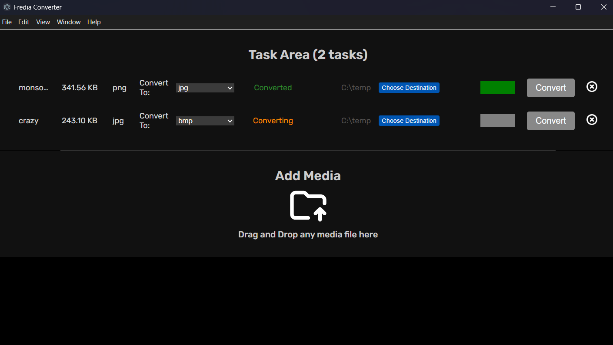

# 🎵 Fredia Converter

**Fredia Converter** is a **free, cross-platform media converter** built with [Electron.js](https://www.electronjs.org/).  
Easily drag and drop your media files, choose your desired format and destination, and convert them with a single click — all while tracking progress in real time.

---

## 📸 Fredia Converter UI



---

## ✨ Features

- **🖱 Drag & Drop Support** – Simply drop your media files into the app.
- **📜 File List View** – See all queued files with details before conversion.
- **⚙️ Custom Conversion Settings** – Choose:
  - Output file type (e.g., MP4, MP3, WAV, AVI, etc.)
  - Destination folder
  - Additional conversion parameters (coming soon)
- **▶ One-Click Conversion** – Hit **Convert** and let Fredia do the rest.
- **📊 Progress Tracking** – Real-time progress bar for each file.
- **💻 Cross-Platform** – Works on Windows, macOS, and Linux.

---

## 🚀 Installation

### 📦 Option 1 – Download Prebuilt Binaries (Recommended)
1. Go to the [GitHub Releases](https://github.com/AbhayJha24/fredia-converter/releases) page.
2. Download the installer or archive for your platform:
   - **Windows** – `.exe` installer or `.zip`
   - **macOS** – `.dmg` or `.zip`
   - **Linux** – `.deb`, or `.tar.gz` or `.zip`
3. Install or extract, then launch **Fredia Converter**.

---

### 🛠 Option 2 – Build from Source (For Developers)

> ⚠️ **Caution:** Do not try this option if you are not a developer, otherwise you may end up breaking your head just like I did when I was in the university.

> ⚠️ **Prerequisite:** Make sure you have [Node.js](https://nodejs.org/) (LTS version recommended) installed on your system before proceeding.  
> You can verify by running `node -v` and `npm -v` in your terminal.

1. **Clone the repository**
   ```bash
   git clone https://github.com/AbhayJha24/fredia-converter.git
   cd fredia-converter
   ```

2. **Install dependencies**

    ```bash
    npm install
    ```

3. **Build for production**

    Run one of the following commands based on your os and arch

    - **Windows (x64):** `npm run build-windows`
    - **Windows (ARM):** `npm run build-windows-arm`
    - **Linux (x64):** `npm run build-linux`
    - **Linux (ARM):** `npm run build-linux-arm`
    - **macOS (Intel):** `npm run build-mac`
    - **macOS (Apple Silicon):** `npm run build-mac-arm`

    For Example:

    ```bash
    npm run build:windows
    ```
4. **Find the build in the dist folder**

    You will now find the build in the `dist` folder

## 🛠 Tech Stack

- **[Electron.js](https://www.electronjs.org/)** – Cross-platform desktop app framework  
- **[Node.js](https://nodejs.org/)** – Backend runtime  
- **[FFmpeg](https://ffmpeg.org/)** – Media processing engine  
- **HTML5 / CSS3 / JavaScript** – UI and logic  

---

## 📂 How It Works

1. **Drag & Drop** your media files into the app window.  
2. Files appear in a **list view** with options to:  
   - Select output format  
   - Choose destination path  
3. Click **Convert**.  
4. **Fredia Converter** uses FFmpeg to process each file.  
5. Watch the **progress bar** update in real time.  
6. Done! Your converted files are ready in the chosen folder.  

---

## 📜 License

This project is licensed under the **MIT License**.  

---

## 🤝 Contributing

Contributions are welcome! If you’d like to improve **Fredia Converter**:

1. Fork the repo  
2. Create a new branch (`feature/your-feature`)  
3. Commit your changes  
4. Push to your branch  
5. Open a Pull Request  

---

## 💡 Future Plans

- Advanced conversion options  
- More output format presets  

---

## 📬 Contact

For questions, suggestions, or bug reports, open an issue on [GitHub Issues](https://github.com/AbhayJha24/fredia-converter/issues).  
